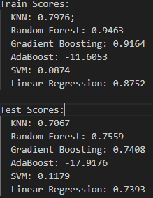
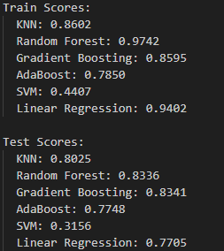
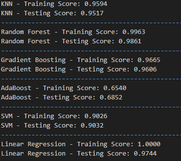
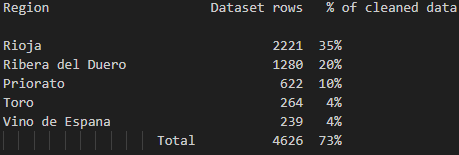
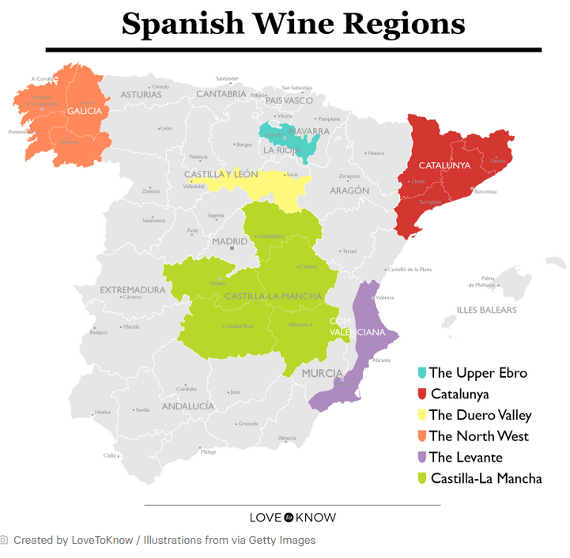
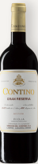

#     Exploratory Data Analysis - Project Team 5
#     Wine Classification  
#     Project 2 

## Overview

The wine industry, is the selected industry for our project.  Specifically, we're focused on the wines that are produced in Spain.  Our dataset is one from Kaggle, the "Spanish Wine Quality Dataset". 

fedesoriano. (April 2022). Spanish Wine Quality Dataset. Retrieved Thursday, May 23, 2024 from https://www.kaggle.com/datasets/fedesoriano/spanish-wine-quality-dataset

It contains 7500 rows, but after some cleaning (dropna), the rows remaining comes out to 6329.

### Featured Winery - Contino

https://contino.es/en/winery/

A tidbit.....
Contino, on a percentage basis, has the most number of rows in our dataset (414).  More than any other winery represented.

Video 2:23 w/subtitles https://youtu.be/UDelPCc1dC4

## Questions

The goal or questions we aim to answer, gleened from our intial review of the columns within our selected dataset are...

     o  Determine the best model configurations to predict price
     o  Determine the best model configurations to predict a rating
     o  Ultimately, using our model(s) here, restaurants wishing to serve Spanish wines can gleen an understanding on price vs. rating 
          when selecting wines for their inventory.   
 
     
Our first attempt at answering the above has revealed the following and provided the confidence we needed to ultimately select this dataset.  This forms our basis to improve on these numbers.

### Initial Scores on y=price

### Initial Scores on y=rating

### Initial Scores on y=type   

## Further Exploration

As mentioned previously, work to improve the model scores will continue.  There are other interesting columns in this dataset which may contribute or hinder this effort. Of course it is all in the details.  

### Regions

There are columns describing the regions (of Spain) where the wines are produced.  This column was excluded during our intial review, but may certainly play an important aspect going forward.  The top five regions according to our data analysis (value counts), reveals:

These top five regions represent 73% of the total cleaned data in our analysis.  This analysis is corraborated by the following article describing the top six wine producing regions in Spain. https://www.lovetoknow.com/food-drink/wine/spain-wine-regions-map

Below is a map of the these regions pulled from the article.....

Correlation to the map as decribed in the article are:

Rioja region in the dataset is in the Upper Ebro (map). 

Both Ribera del Duero and Toro regions are in the Duero Valley (map).

Priorato (dataset) is in the Catalunya (map).

Vino de Espana (dataset) is generally in multiple regions.

Of course other columns exist that may influence our model scores as we proceed with the exploration.  As touched on in the beginning, there is a column on wineries, from which Contino was found to have the most representation (rows) in our data.

# Summary

This concludes the EDA at this point and will be incorporated into our final presentation.

  

