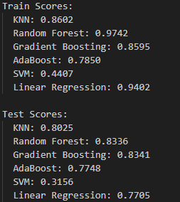
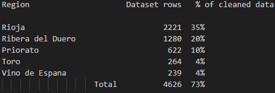
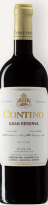

#     README - Project Team 5
#     Wine Classification  
#     Project 2 

## Overview

The wine industry, is the selected industry for our project.  Specifically, we're focused on the wines that are produced in Spain.  Our dataset is one from Kaggle, the "Spanish Wine Quality Dataset". 

fedesoriano. (April 2022). Spanish Wine Quality Dataset. Retrieved Thursday, May 23, 2024 from https://www.kaggle.com/datasets/fedesoriano/spanish-wine-quality-dataset

It contains 7500 rows, but after some cleaning (dropna), the rows remaining comes out to 6329.

### Featured Winery - Contino

https://contino.es/en/winery/

A tidbit.....
Contino, on a percentage basis, has the most number of rows in our dataset (414).  More than any other winery represented.

Video 2:23 w/subtitles https://youtu.be/UDelPCc1dC4

## Questions

The goal or questions we aim to answer, gleened from our intial review of the columns within our selected dataset are...

     o  Determine the best model configurations to predict price
     o  Determine the best model configurations to predict a rating
     o  Through iterative means, can model scores be improved, i.e. using different scalers?
     o  Ultimately, using our model(s) here, restaurants wishing to serve Spanish wines can gleen an understanding on price vs. rating 
          when selecting wines for their inventory.   
 
     
Our first attempt at answering the above has revealed the following and provided the confidence we needed to ultimately select this dataset.  This forms our basis to improve on these numbers.

### Initial Scores on y=price

### Initial Scores on y=rating

### Initial Scores on y=type   

## Further Exploration

As mentioned previously, work to improve the model scores will continue.  There are other interesting columns in this dataset which may contribute or hinder this effort. Of course it is all in the details.  

### Regions

There are columns describing the regions (of Spain) where the wines are produced.  This column was excluded during our intial review, but may certainly play an important aspect going forward.  The top five regions according to our data analysis (value counts), reveals:

These top five regions represent 73% of the total cleaned data in our analysis.  This analysis is corraborated by the following article describing the top six wine producing regions in Spain. https://www.lovetoknow.com/food-drink/wine/spain-wine-regions-map

Below is a map of the these regions pulled from the article.....

Correlation to the map as decribed in the article are:

Rioja region in the dataset is in the Upper Ebro (map). 

Both Ribera del Duero and Toro regions are in the Duero Valley (map).

Priorato (dataset) is in the Catalunya (map).

Vino de Espana (dataset) is generally in multiple regions.

Of course other columns exist that may influence our model scores as we proceed with the exploration.  As touched on in the beginning, there is a column on wineries, from which Contino was found to have the most representation (rows) in our data.

## Price Predictons through Prophet

This section focuses on our effort to use Prophet to perform predictions on pricing.  Our approach entailed identifying a couple wines from our featured winery - Contino.  According to Contino's website, they produce eight different varieties. 
Our dataset reflected four of these wines as listed below.

 

The wines selected for these price predictions are 

   1) Vina del Olivo (202 rows)
   2) Rioja Graciano  (6 rows)

A wine with several rows of data, and another with limited rows.  

To perform Prophet predictons, a datetime series dataframe is needed.  However, the only column that comes close to a date in our dataset, is the year column.  This hardly comes close to a date.  Therefore, massaging of the year column is in order. First, a dataframe containing only records representing the Contino winery was created. Second, after the year had all NAN/null rows removed, it was appended with a year-end date, by appending December 31.  For example: if the year column had 2004 as the year, it was appended with -12-31.  This turned the year into a full date as a string of 2004-12-31, thereby providing the prerequisite date format to proceed.  The next obstacle to overcome was Prophet's lack of support for a forcasting frequency by year.  The limited yearly data we had did not provide a decent basis for our forcasting. A forecast was predicted with the limited data available on both a monthly and yearly frequency going out three years.  The resulting graphs didn't portray anything of value.  Hence, more data massaging was necessary.  

Our problem was essentially a lack of data, so next was an effort to remedy such, by providing more data to the model.  Through some Pandas resampling code, a full 365/6 day year (one row for each day) was generated. This was done for every year of data that our dataset started with, and continued through the last year.  Now we have the sample data needed for better forcasting.  The resample code provides the ability to forward fill or backward fill our data column (price in this case).  This means that for all the new rows the resample adds, the price column will be filled with the price contained in the next (12-31) row that exists looking forward (ffill).  Backward fill (bfill) does the opposite, by filling the price from the last previous (12-31) row to each row added up to the next pre-existing (12-31) row (which will be used subsequently in the next missing group of dates).  

For our first wine, Vina del Olivo, the Prophet graph below show the history (both existing and added/padded forward fill rows from the resampling), as well as the forecast staring for year 2018 through 2020.  The sampling data is daily, with period and frequency at 36 and monthly respectively.  

Please note:  The black lines represent the daily plot sample data.  They appear as lines, but are actually dots strung next to each throughout time. 

Our next graph is for the same wine, but the data samples are backward filled rather than forward filled as in the previous graph. 

At first glance, the back filled plot appears to have less uncertainty.  However, the price or "y" scale is compressed a lot more for on the backfill slide ($0-$350), versus $0-$180 for the forward filled samples, giving the illusion of less uncertainty - NOT THE CASE.  Moreover, it appears the reason for the greater compresssion of price on the backfill slide, is that there is a lot more uncertainty in the later years of the forecast (2019-2020).  There is double the amount of uncertainty (using backfill) at the end of 2020 versus that of using forward fill.  Appearance is definetely deceiving for backfill.
Given this amount of uncertainty, regardless of direction of fill (back vs forward), predicting price beyond six months is unreliable.  

This level of uncertainty is even more pronounced when the frequency is changed to quarterly, per the next slide, and still using daily samples.  Fewer checkpoints does not appear to improve matters, rather it hinders the illustration.    

Our next wine of study for price prediction using Prophet, is Contino's Rioja Graciano. There was considerably more data for this wine than Vina de Olivo.  This wine also has a more consistent/stable price range than our previous wine as well.    

Graciano for short, is depicted in the next graph using a Prophet frequency of month, a forecast period of 36 (months - 3 years), with daily samples using the forward fill method for resampling.  Again, it is pretty obvious by this graph, that a forecast period of 6 months to 1 year is likely the best.  Anything beyond is not very reliable, as depicted by the uncertainty interval.

The trajectory of the forecast is in the right direction too.  This will be discussed in more depth further down in the Prophet Summary.

The graph for Gracino below is based on the same forecast period and frequency as the graph above.  Only difference is the resampling fill was done with backward fill.  Through these forecasts, it has been learned that backward fill is ineffective and contributes to an inorrect forecast.  It is shown here to illustrate the ineffectiveness of backward fill in this case as well. The forecast trajectory is in the wrong (downward) direction.  

Lastly, one more observation was done with Graciano that was on a quarterly basis versus the one done for monthly, forward fill .  The difference between the monthly vs. quarterly was nil.     

## Conclusion Using Prophet

###  Vina de Olivo

More than likely, due to a lack of data and volatile pricing over the years, Prophet was unable to correctly predict the price as compared to the Wine Searcher's website.  Prophet predicted a price range of between 100 and 105 Euros for the first six months of 2018.  Wine Searher's website shows an average price of 66 Euros .....
https://www.wine-searcher.com/find/c+v+n+e+vinedo+contino+vina+olivo+doca+rioja+alavesa+spain/2018?Xcurrencycode=EUR&Xtax_mode=e&Xsavecurrency=Y#t5

###  Rioja Graciano

In contrast to Vina de Olivo, Graciano had more data for use and a more stable price.  In our estimation, both of these data characteristics contributed to a better prediction by Prophet. Prophet predicted a price range of between 65 and 67 Euros for the first six months of 2018.  Wine Searher's website shows an average price of 64 Euros, which is a much more aligned prediction .....

https://www.wine-searcher.com/find/c+v+n+e+vinedo+contino+graciano+doca+rioja+alavesa+spain/2018?Xtax_mode=e

With more time going forward, additional wines would be researched using Prophet.  It does demonstrate the ability to predict, but more wine and more 
data behind the wine, would be an interesting pursuit.   

# Summary

This concludes the EDA at this point and will be incorporated into our final presentation.

  

